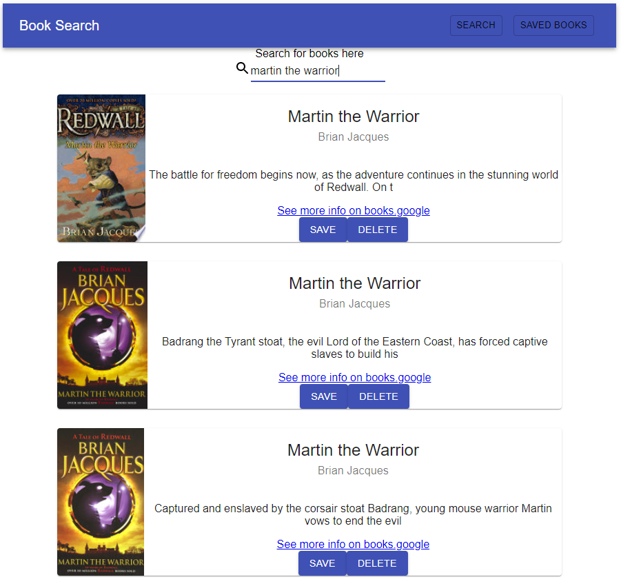
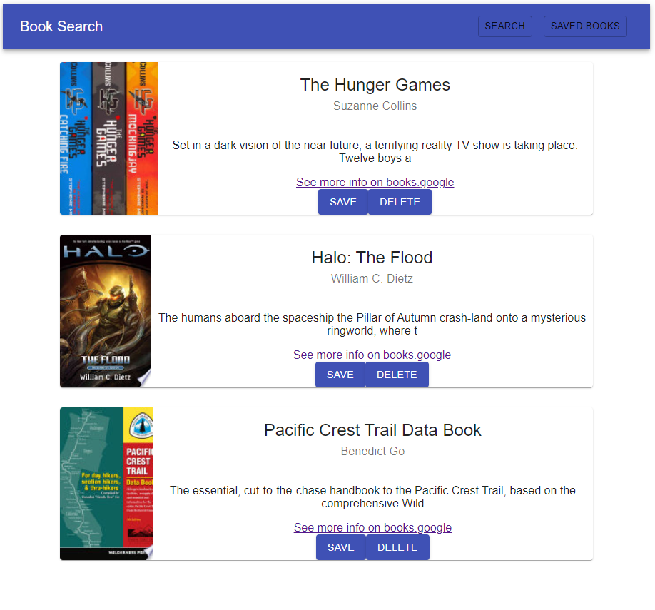

# Google Books Search & Save

## Description
This application uses the Google Books API to enable a user to find books and save them to their databse.  Users can save and delete books from their list as they progress through their reading list. Data is stored in MongoDB Atlas and inclides book title, authors, cover image, and link to the book on books.google.com

## Table of Contents
* [Installation](#installation)
* [Usage](#usage)
* [Credits](#credits)
* [License](#license)
* [Contributing](#Contributing)
* [Tests](#Tests)
* [Questions](#Questions)

## Installation
Clone this repository and run command "npm install" to get dependencies

## Usage
### To run locally
Enter the command "npm start" to start application and navigate to localhost:8080 in your browser
### Use on Heroku
[Heroku Application](https://korys-google-book-search.herokuapp.com/savedbooks)

## License
This repository is licensed under the MIT license

## Contributing
No additional contributions are expected for this application

## Tests
There are currently no test for this application

## Questions
#### For any questions about this repository send an email to kory.nelson99@gmail.com
#### View my full GitHub at [https://github.com/korynelson](https://github.com/korynelson)

